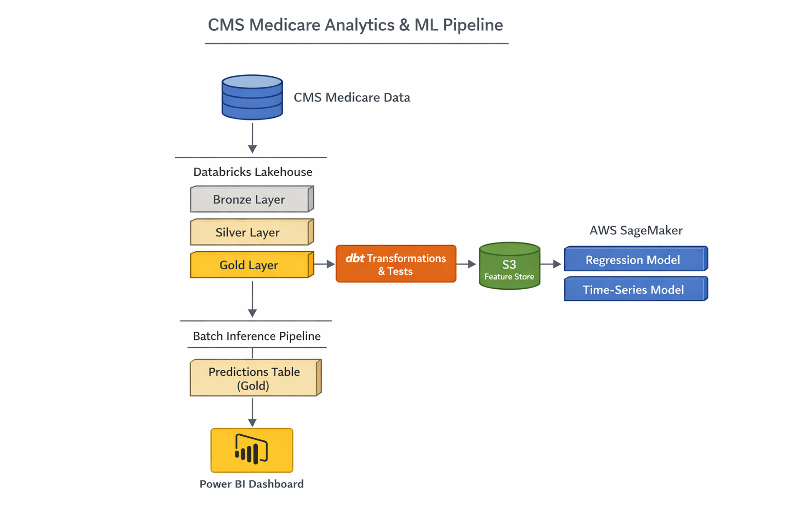
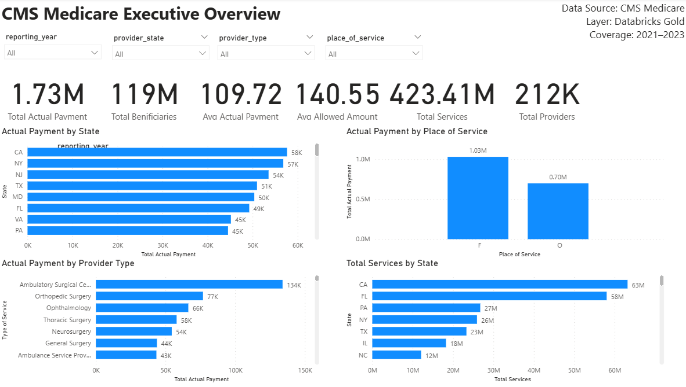
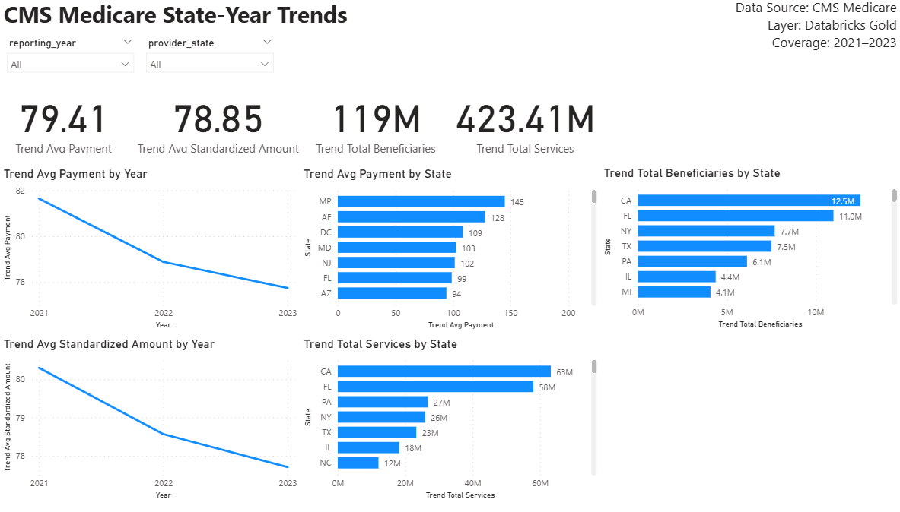
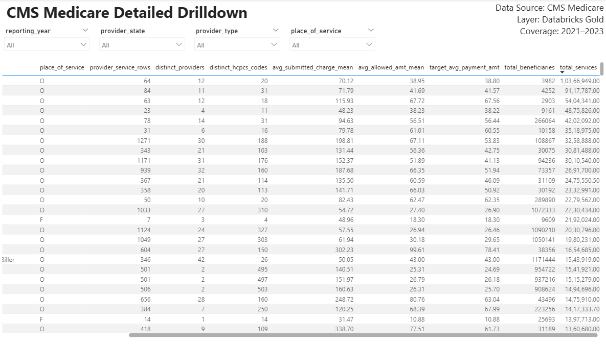
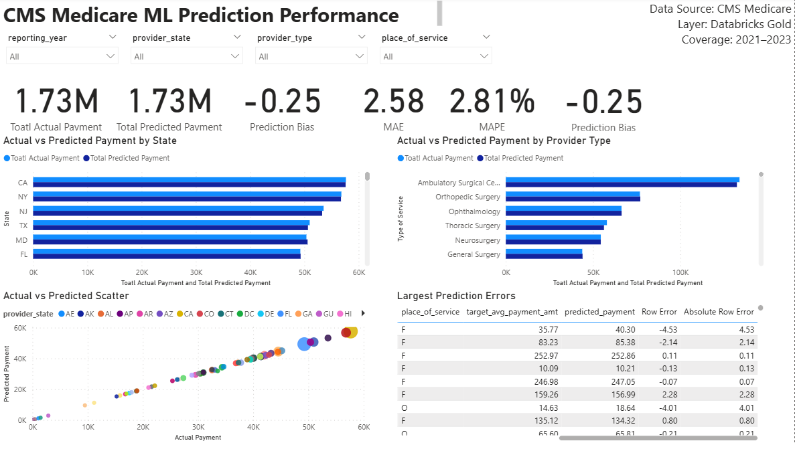

# CMS Medicare Analytics + ML Pipeline  
**Databricks + dbt + AWS SageMaker + Power BI**

End-to-end analytics and machine learning project built on CMS Medicare public use data to create a modern data platform and reporting layer for reimbursement analysis, trend monitoring, and prediction performance evaluation.

## Project Overview

This project implements a full data-to-dashboard workflow using Databricks, dbt, AWS SageMaker, S3, and Power BI.

The pipeline ingests CMS Medicare public data into Databricks, transforms it through a Bronze → Silver → Gold architecture, engineers analytics-ready features, trains machine learning models in SageMaker, generates batch predictions, and exposes curated Gold tables to Power BI for dashboarding.

## Business Goal

The objective of this project is to build a scalable analytics and ML workflow for Medicare provider service data that can:

- analyze reimbursement and utilization patterns
- monitor payment trends across states and provider types
- predict average payment amounts using regression
- support time-series trend analysis
- surface insights through an executive-style Power BI dashboard

## Data Access

Raw CMS Medicare source files are not stored in this repository due to file size.

Official source links:
- `https://data.cms.gov/`
- `https://www.cms.gov/Research-Statistics-Data-and-Systems/Statistics-Trends-and-Reports/Medicare-Provider-Charge-Data`

This project uses CMS Medicare public use data as the Bronze-layer source for downstream Databricks, dbt, SageMaker, and Power BI workflows.

## Architecture

### End-to-End Flow

1. CMS Medicare public use data ingested into Databricks Bronze layer  
2. Bronze data cleaned and standardized into Silver layer  
3. dbt transforms Silver tables into Gold analytics-ready models  
4. Gold features exported/stored for machine learning workflows  
5. AWS SageMaker trains:
   - regression model for average payment prediction
   - time-series model for trend analysis
6. Batch inference pipeline generates prediction outputs  
7. Prediction outputs loaded back into Databricks Gold layer  
8. Power BI connects to Databricks and visualizes:
   - payment trends
   - provider/service patterns
   - actual vs predicted performance
   - model error metrics

   ## Architecture Diagram



## Tech Stack

- **Databricks** for lakehouse storage and transformation
- **Delta Lake** for managed analytical tables
- **dbt** for SQL-based transformations, testing, and documentation
- **AWS S3** for intermediate storage / feature data
- **AWS SageMaker** for regression and time-series modeling
- **Python** for ML workflows and batch inference
- **SQL** for analytics models and transformations
- **Power BI** for executive dashboarding

## Data Model

### Bronze
Raw CMS Medicare provider/service data ingested into Databricks.

### Silver
Cleaned, standardized, and validated provider-service level dataset.

### Gold
Business-ready tables used for reporting and ML:

- `gold_regression_features`
- `gold_state_year_payment_trend`
- `gold_regression_predictions`

## Machine Learning Components

### 1. Regression Model
Used to predict:

- `target_avg_payment_amt`

Output includes:

- actual payment
- predicted payment
- model evaluation metrics in Power BI

### 2. Time-Series / Trend Modeling
Used to analyze state-year payment trends and support forecasting-oriented reporting.

## Power BI Dashboard

The Power BI layer is built directly on curated Databricks Gold tables and includes 4 report pages:

### Page 1 — Executive Overview
- total actual payment
- total services
- total beneficiaries
- provider and state breakdowns
- place of service analysis

### Executive Overview


### Page 2 — State-Year Trends
- average payment by year
- standardized amount trends
- state-level utilization and payment views

### State-Year Trends


### Page 3 — Detailed Drilldown
- granular provider/service-level table
- filterable by year, state, provider type, and place of service

### Detailed Drilldown


### Page 4 — ML Prediction Performance
- total actual vs total predicted payment
- prediction error
- MAE
- MAPE
- prediction bias
- actual vs predicted comparisons by state and provider type
- scatter plot for model fit
- largest prediction error table

### ML Prediction Performance


## Example Metrics

Model evaluation surfaced in Power BI includes:

- **Prediction Error**
- **MAE (Mean Absolute Error)**
- **MAPE (Mean Absolute Percentage Error)**
- **Prediction Bias**

## Repository Structure

```text
cms-medicare-ml-pipeline/
├── README.md
├── dbt/
│   └── cms_medical_dbt/
│       ├── dbt_project.yml
│       ├── models/
│       │   ├── bronze/
│       │   ├── silver/
│       │   └── gold/
│       ├── macros/
│       ├── tests/
│       └── packages.yml
├── databricks/
├── sagemaker/
├── powerbi/
└── docs/